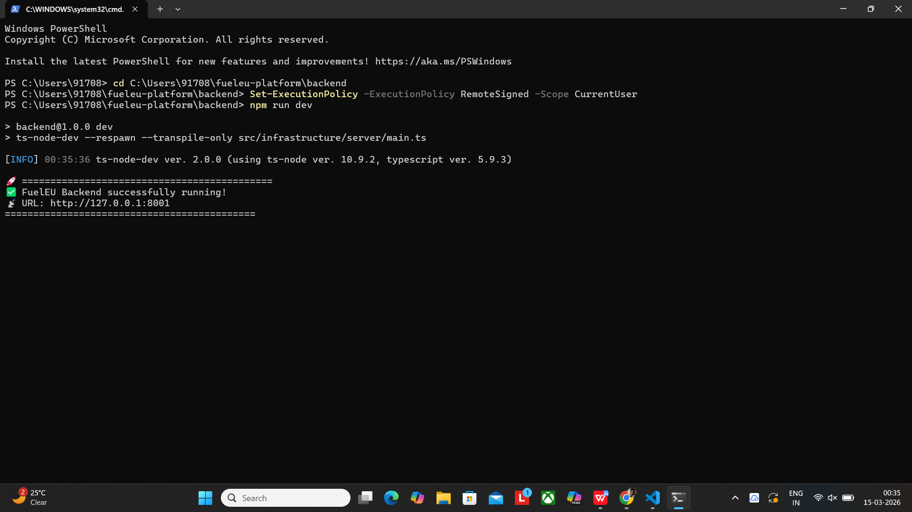
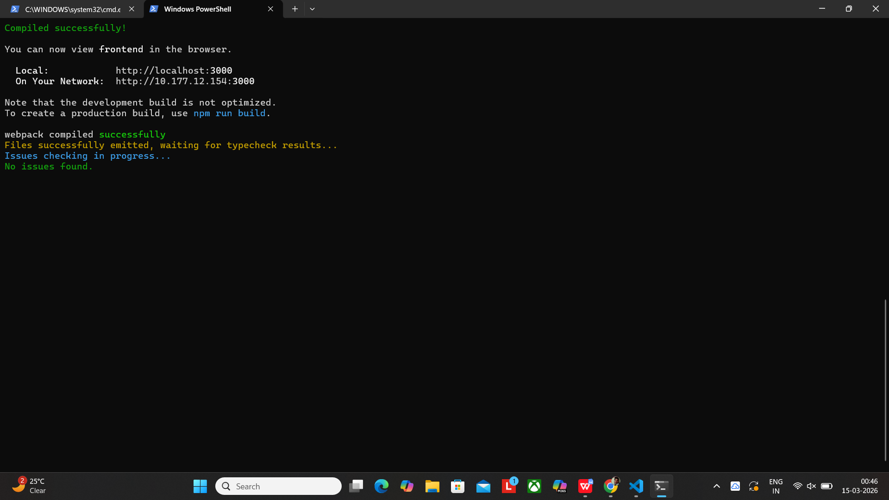
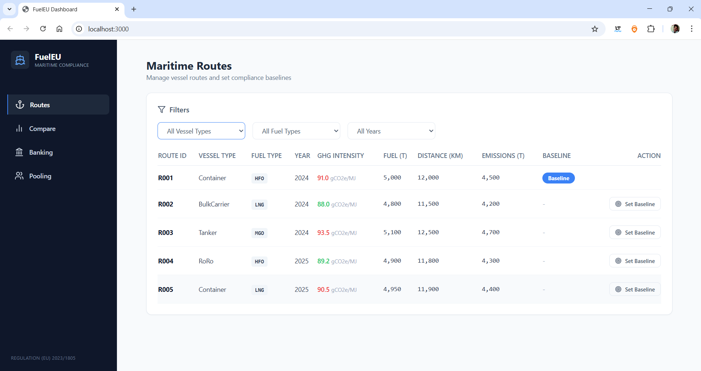
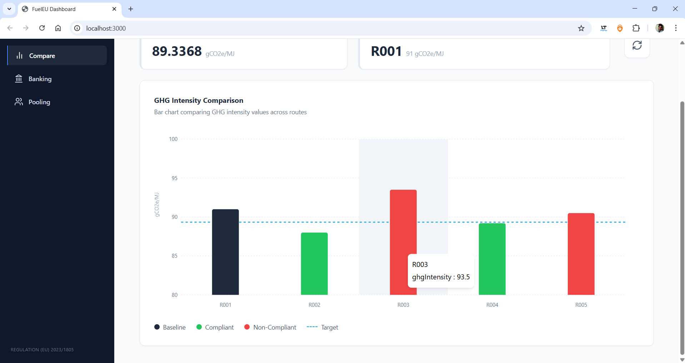
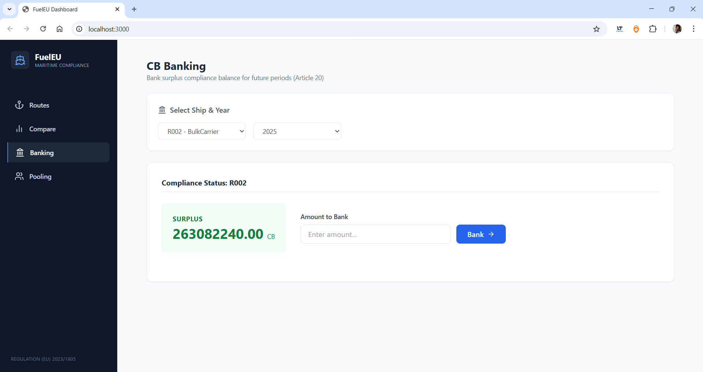
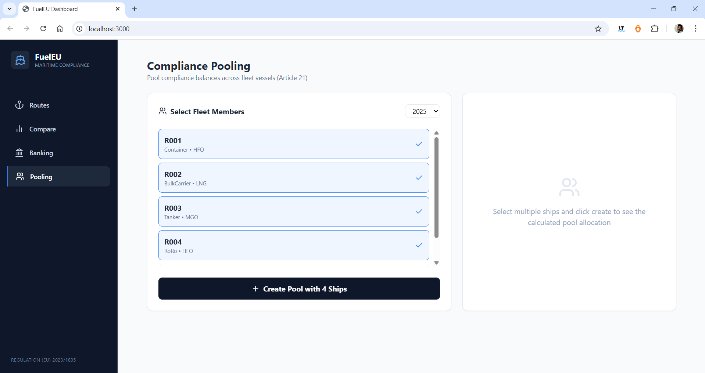

# FuelEU Maritime Compliance Platform 🚢

A full-stack SaaS platform designed to manage and calculate maritime greenhouse gas (GHG) intensity in compliance with the **FuelEU Maritime Regulation (EU) 2023/1805**. 

## 🏗️ Architecture & Tech Stack
This project is built using a modern **Hexagonal Architecture (Ports and Adapters)** for the backend, ensuring high maintainability and clear separation of concerns.

### Frontend
* **Framework:** React 18 with TypeScript
* **Styling:** Tailwind CSS
* **Charts:** Recharts
* **Icons:** Lucide React

### Backend
* **Runtime:** Node.js with Express
* **Language:** TypeScript
* **Architecture:** Hexagonal (Domain, Application, Adapters, Infrastructure)
* **Database:** PostgreSQL (via Prisma ORM)

## ✨ Features
1. **Routes Management:** Filter, view, and set compliance baselines for individual vessel routes.
2. **Compliance Comparison:** Dynamic, color-coded bar charts comparing actual GHG intensity against the 2025 regulatory target (89.3368 gCO2e/MJ).
3. **CB Banking:** Simulate banking surplus compliance balance (CB) for future reporting periods.
4. **Compliance Pooling:** Select multiple fleet vessels to calculate pooled compliance allocations.

## 🚀 Getting Started

### 1. Backend Setup
Navigate to the backend directory, install dependencies, and start the server:
`cd backend`
`npm install`
`npx prisma db push`
`npm run dev`

### 2. Frontend Setup
Navigate to the frontend directory, install dependencies, and start the React app:
`cd frontend`
`npm install`
`npm start`

### 3. Screenshots

**Terminal Execution (Backend & Frontend)**

**Application UI**

*Routes Management & Filtering*

*Compliance Comparison Dashboard*

*CB Banking Interface*

*Compliance Pooling Selection*
